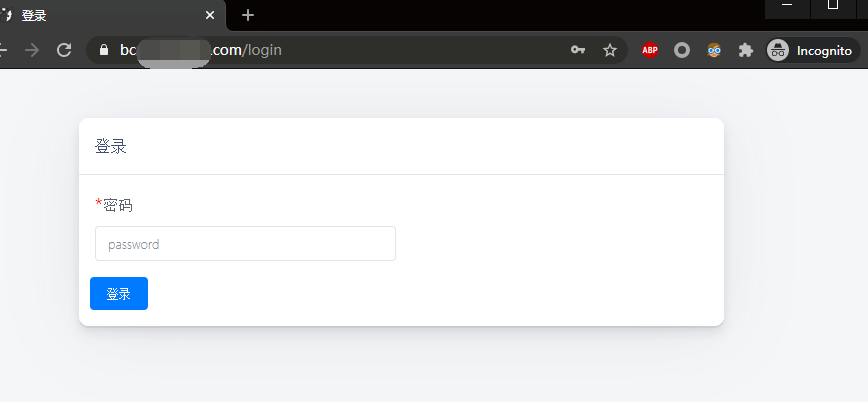
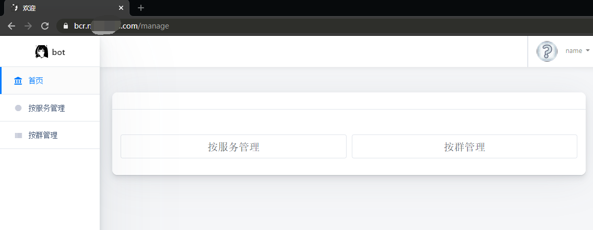
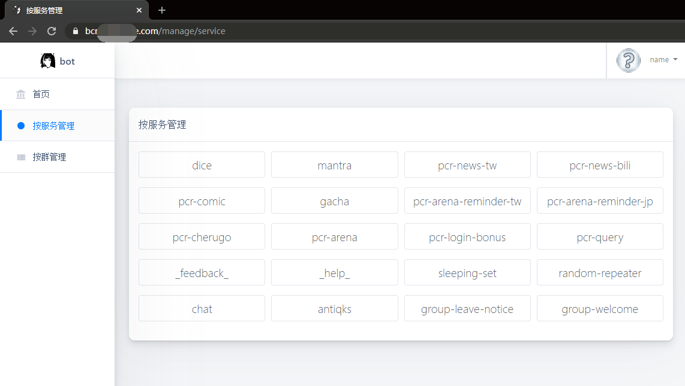
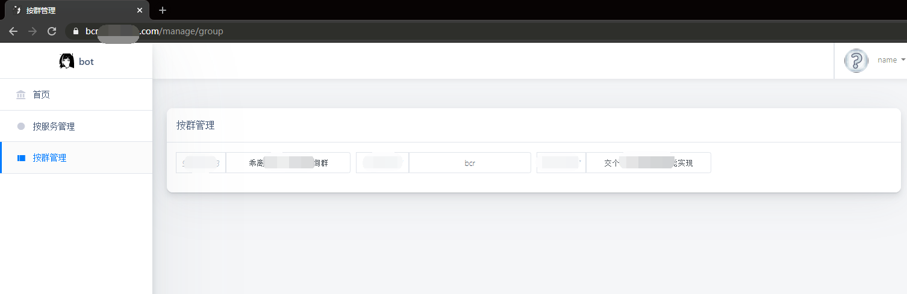
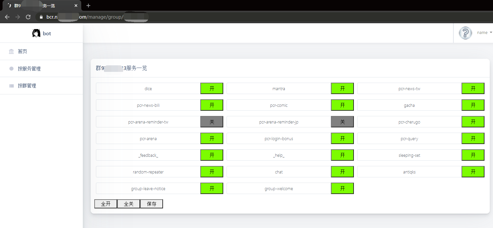

# 简介

基于一个叫`hoshinoV2服务开关网页版.zip`的东西改出来的玩意儿，web管理hoshino的service开关的东西。

## 安装

1. 前略装好hoshinobot。

2. 整个`bot_manager_web`目录塞进`hoshino/modules`目录下面。

3. 在`hoshino/config/__bot__.py`文件中添加模块引用。MODULES_ON 这个字典中添加一行`'bot_manager_web'`。

4. 在`hoshino/config`目录下塞个叫`bot_manager_web.py`的文件，里面写下面这些变量，让模块可以正常被使用。

```python
import os
from .__bot__ import HOST, PORT

# 显示ICP备案相关的内容，如果没有ICP备案信息要显示的话保持为空就可以了
ICP_CONTENT = ''
# 私聊机器人“bot设置”返回的网址基础域名，默认是从hoshino的配置中读取
PUBLIC_ADDRESS = f"http://{HOST}:{PORT}"
# 访问bot manager web的密码。公网服务没有身份验证是很危险的，密码建议自行修改！！！
PASSWORD = '987654321'
```

PS: 如果有容器运行的需求的话，配置文件可以用下面这个：

```python
import os
from .__bot__ import HOST, PORT

# 显示ICP备案相关的内容，如果没有ICP备案信息要显示的话保持为空就可以了
ICP_CONTENT = os.environ.get('ICP_CONTENT') if os.environ.get('ICP_CONTENT') else ''
# 私聊机器人“bot设置”返回的网址基础域名，默认是从hoshino的配置中读取
PUBLIC_ADDRESS = os.environ.get('PUBLIC_ADDRESS') if os.environ.get('PUBLIC_ADDRESS') else f"http://{HOST}:{PORT}"
# 访问bot manager web的密码。公网服务没有身份验证是很危险的，密码建议自行修改！！！
PASSWORD = os.environ.get('BOT_MANAGER_WEB_PASSWORD') if os.environ.get('BOT_MANAGER_WEB_PASSWORD') else '987654321'
```

## 使用

访问`https://bcr.yourdomain.com/manage`

输入上面文件里设定的密码登录（至于为啥没有用户名，反正只有一个人会去登录的东西要什么用户名！）

然后是进入服务里管理群功能开关，还是进入群列表管理服务功能开关，正常人都能看懂吧。

PS: 注销按钮我也不知道为啥要存在，想了想也没啥意义就没做了。

PPS: 还有部分垃圾文件懒得看了，体积也不算太过夸张懒得抽了，有人有空可以抽一抽。

PPPS：友情提示！使用云服务器请确认对应端口在云服务器中是否开放！使用windows服务器请在服务器的防火墙中确认对应端口是否开放！

## 图示






